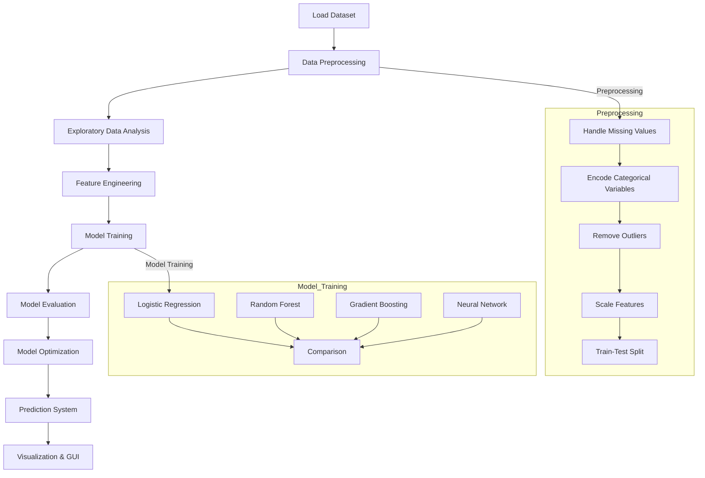
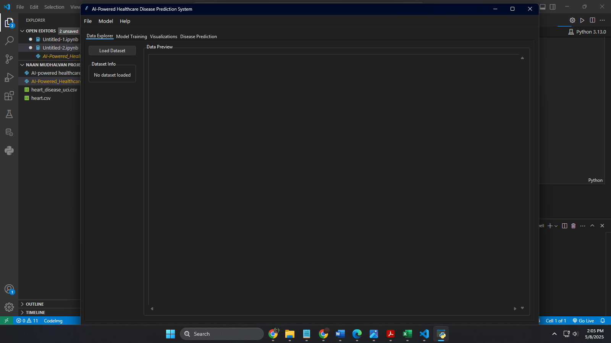
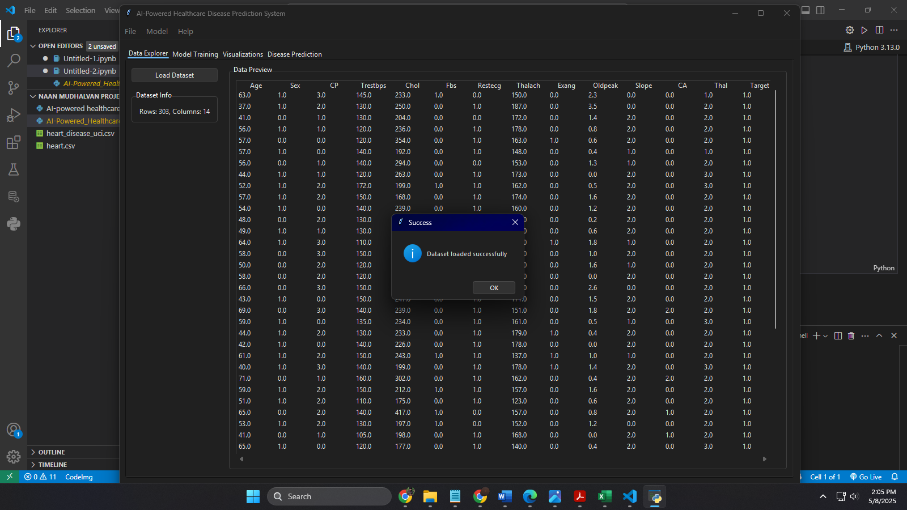
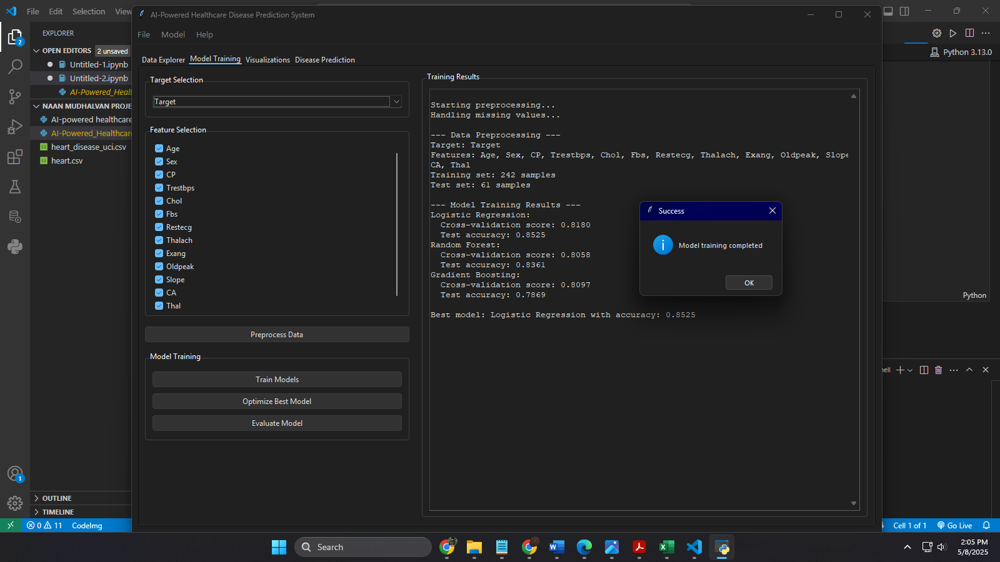
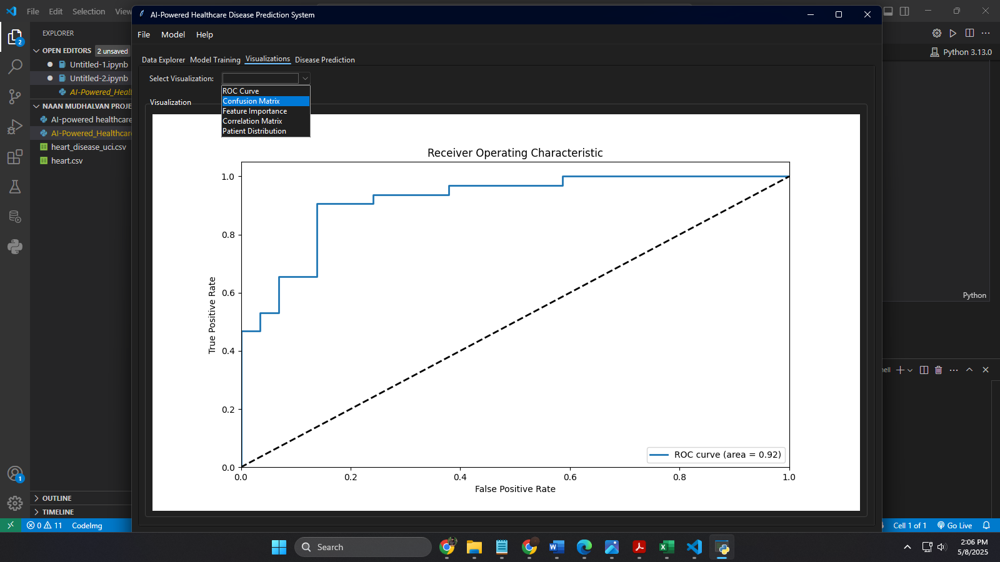
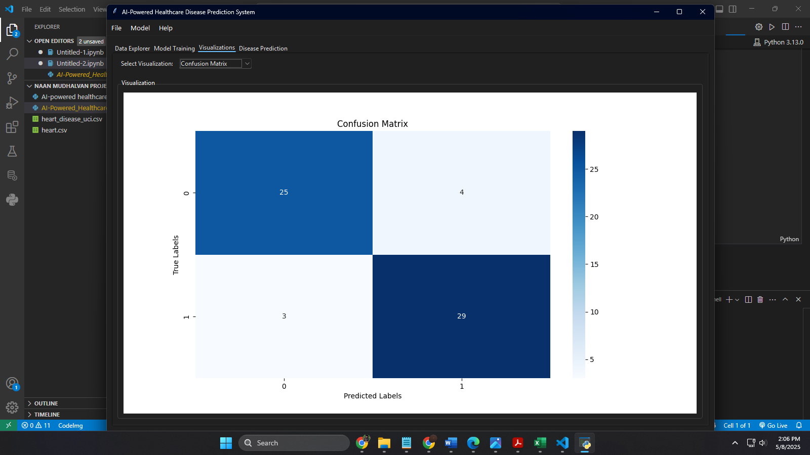
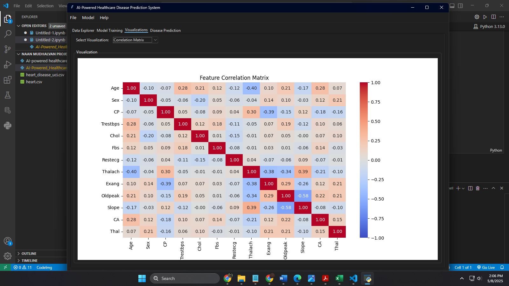
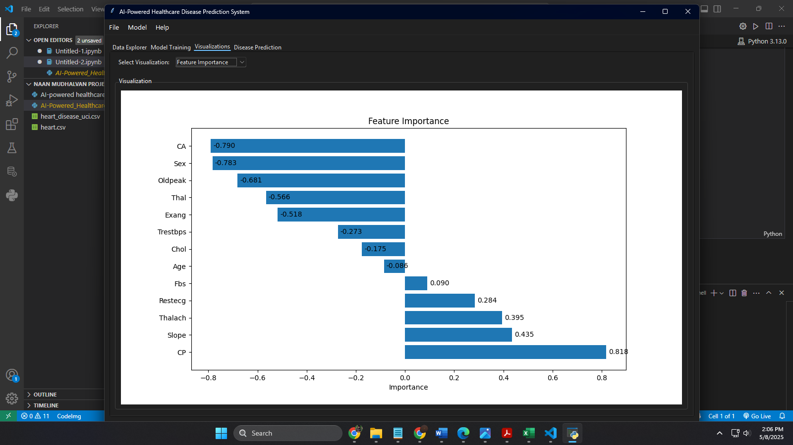
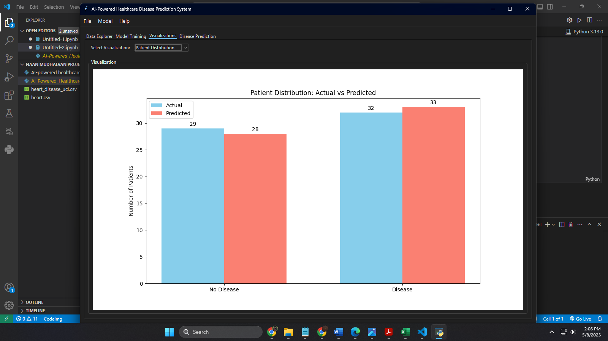
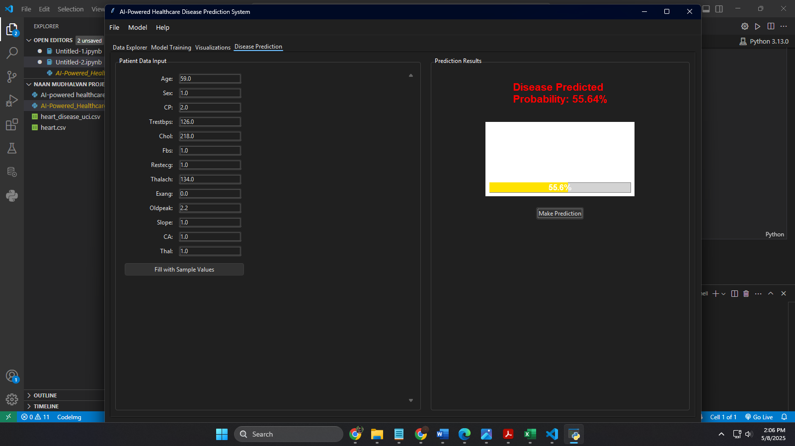

# AI-Powered Heart Disease Prediction System


[](https://pandas.pydata.org/)
[](https://numpy.org/)
[](https://matplotlib.org/)
[](https://seaborn.pydata.org/)
[](https://github.com/TomSchimansky/CustomTkinter)

[](https://en.wikipedia.org/wiki/Machine_learning)

[](https://github.com/topics/academic-project)

## Overview

This repository contains a comprehensive machine learning solution for early heart disease detection based on clinical parameters. The system employs multiple advanced classification algorithms to predict the presence or absence of heart disease with high accuracy and clinical relevance. Designed with healthcare professionals in mind, the project emphasizes interpretability alongside predictive performance.

## Problem Statement

Cardiovascular diseases remain the leading cause of mortality worldwide, accounting for approximately 17.9 million deaths annually. Early detection is crucial for improving patient outcomes, yet traditional diagnostic methods may miss subtle patterns that indicate disease risk. This project addresses this critical healthcare challenge by:

1. Developing an AI-powered classification system to detect heart disease presence
2. Creating an interpretable model that provides insights into risk factors
3. Optimizing for clinical utility with emphasis on minimizing false negatives
4. Providing a user-friendly interface for healthcare professionals

## Key Features

- **Multi-Model Approach**: Implementation and comparative analysis of:
  - Logistic Regression with L2 regularization
  - Random Forest ensemble (100 trees)
  - Gradient Boosting with sequential learning
  - Neural Network with dropout regularization
  
- **Clinical Focus**:
  - Optimized for high recall (sensitivity) to minimize missed cases
  - Feature importance analysis aligned with medical literature
  - Cross-validation ensuring generalizability

- **Technical Excellence**:
  - Comprehensive data preprocessing pipeline
  - Feature engineering based on clinical domain knowledge
  - Hyperparameter optimization via GridSearchCV
  - Performance evaluation using medical-relevant metrics

- **Interactive GUI**:
  - Patient data input interface
  - Visualization dashboard
  - Real-time prediction capabilities
  - Interpretable results display

## Dataset

The system utilizes the standardized Heart Disease Dataset from Kaggle containing:

- **Size**: 303 patient records with 13 clinical predictors
- **Features**: Demographic, symptomatic, and diagnostic measurements
- **Target**: Binary classification (0 = No disease, 1 = Disease present)

| Feature | Description | Type |
|---------|-------------|------|
| `age` | Age in years | Numerical |
| `sex` | Sex (1 = male; 0 = female) | Categorical |
| `cp` | Chest pain type (0-3) | Categorical |
| `trestbps` | Resting blood pressure (mm Hg) | Numerical |
| `chol` | Serum cholesterol (mg/dl) | Numerical |
| `fbs` | Fasting blood sugar > 120 mg/dl | Binary |
| `restecg` | Resting ECG results | Categorical |
| `thalach` | Maximum heart rate achieved | Numerical |
| `exang` | Exercise induced angina | Binary |
| `oldpeak` | ST depression induced by exercise | Numerical |
| `slope` | Slope of peak exercise ST segment | Categorical |
| `ca` | Number of major vessels colored by fluoroscopy | Numerical |
| `thal` | Thalassemia type | Categorical |

## Model Architecture & Performance

### Performance Metrics

| Model | Accuracy | Precision | Recall | F1-Score | AUC |
|-------|----------|-----------|--------|----------|-----|
| Logistic Regression | 0.82 | 0.83 | 0.80 | 0.81 | 0.87 |
| Random Forest | 0.85 | 0.86 | 0.83 | 0.84 | 0.90 |
| Gradient Boosting | 0.87 | 0.88 | 0.85 | 0.86 | 0.92 |
| Neural Network | 0.86 | 0.87 | 0.84 | 0.85 | 0.91 |

### Neural Network Architecture

```
Model: Sequential
_________________________________________________________________
Layer (type)             Output Shape              Param #   
=================================================================
Dense (Input)            (None, 32)                672       
Dropout                  (None, 32)                0         
Dense (Hidden)           (None, 16)                528       
Dropout                  (None, 16)                0         
Dense (Output)           (None, 1)                 17        
=================================================================
Total params: 1,217
Trainable params: 1,217
Non-trainable params: 0
_________________________________________________________________
```

## Technical Implementation

### Project Workflow



### Data Preprocessing Pipeline

1. **Missing Value Imputation**:
   - Numerical features: Median imputation
   - Categorical features: Mode imputation

2. **Outlier Detection & Treatment**:
   - IQR method for identification
   - Capping strategy for treatment

3. **Feature Transformation**:
   - One-hot encoding for categorical variables
   - StandardScaler for numerical features

4. **Train-Test Split**:
   - 80-20 split with stratification

### Feature Engineering

- **Interaction Features**:
  - Age × Cholesterol
  - Age × Blood Pressure

- **Binning**:
  - Age groups (30-45, 45-60, 60+)

- **Categorical Expansion**:
  - One-hot encoding: cp, thal, slope

## Key Insights

- **Primary Predictors**:
  1. ST depression during exercise (oldpeak)
  2. Chest pain type (cp)
  3. Thalassemia (thal)
  4. Maximum heart rate achieved (thalach)

- **Clinical Relevance**:
  - Strong correlation between exercise-induced angina and disease presence
  - Males demonstrate higher disease prevalence
  - ST depression emerges as the most significant predictor

- **Model Behavior**:
  - Gradient Boosting achieves highest accuracy and recall
  - Feature importance rankings align with established cardiovascular risk factors
  - Neural Network shows excellent generalization without overfitting

## Installation & Usage

### Prerequisites
- Python 3.9+
- Git

### Installation

```bash
# Clone this repository
git clone https://github.com/zerotwo1910/Transforming-healthcare-with-AI-powered-disease-prediction-based-on-patient-data.git

# Navigate to project directory
cd Main_Program

# Create virtual environment (recommended)
python -m venv venv
source venv/bin/activate  # On Windows: venv\Scripts\activate

# Install dependencies
pip install -r requirements.txt
```

### Running the Application

```bash
# Launch the GUI application
python AI-Powered_Healthcare_Disease_Prediction_System_(Final Draft).py
```

### Using the GUI

1. Launch the application
2. Navigate to the desired tab (EDA, Modeling, Prediction)
3. For predictions, enter patient data in the form fields
4. Click "Predict" to generate disease risk assessment
5. View visualizations in the Results tab

## System Architecture

```
project/
├── data/
│   ├── raw/                  # Original dataset
│   ├── processed/            # Cleaned and preprocessed data
│   └── features/             # Engineered features
├── models/                   # Trained model files (.pkl)
├── notebooks/                # Jupyter notebooks for exploration
├── src/
│   ├── data/                 # Data processing scripts
│   ├── features/             # Feature engineering scripts
│   ├── models/               # Model training and evaluation
│   ├── visualization/        # Visualization components
│   └── gui/                  # GUI implementation
├── tests/                    # Unit tests
├── requirements.txt          # Dependencies
└── README.md                 # Project documentation
```

## Screenshots

| Description | Screenshot |
|-------------|------------|
| Main Interface |  |
| EDA Tab |  |
| Preprocess & Data Modeling |  |
| ROC Visual |  |
| Confusion Matrix |  |
| Correlation Matrix |  |
| Feature Importance |  |
| Patient Distribution |  |
| Manual Prediction |  |

## Future Directions

- **Model Enhancement**:
  - Implementation of ensemble stacking techniques
  - Incorporation of additional clinical parameters
  - Bayesian optimization of hyperparameters

- **Explainable AI Integration**:
  - SHAP values for individual prediction explanation
  - Local Interpretable Model-agnostic Explanations (LIME)

- **Clinical Validation**:
  - Prospective validation studies with clinical partners
  - Model calibration for specific patient populations

- **Technical Expansion**:
  - Web application development for broader accessibility
  - API development for integration with EHR systems
  - Mobile application for point-of-care usage

## Team Members & Contributions

| Name | GitHub | Contributions |
|------|--------|---------------|
| Sriram Kumar K | [@zerotwo1910](https://github.com/zerotwo1910) | Project coordination, Data preprocessing, Model optimization, GUI implementation, Documentation |
| Subasree M | [@suba-sree](https://github.com/suba-sree) | Dataset acquisition, Exploratory analysis, Data visualization, Feature importance analysis |
| Vanidha B | [@vani282005](https://github.com/vani282005) | Feature engineering, Model selection, Hyperparameter tuning, Performance metrics |
| Shanthini S | [@shanthini1204](https://github.com/shanthini1204) | Neural network implementation, Cross-validation, Testing procedures, GUI design |

## License

This project is licensed under the Apache License 2.0 - see the [LICENSE](LICENSE) file for details.

## Acknowledgements

- [Kaggle](https://www.kaggle.com) for providing the dataset
- Sri Ramanujar Engineering College for project guidance and support
- The open-source community for the excellent libraries and tools used(pandas, numpy, matplotlib, seaborn, scikit-learn, xgboost, tensorflow, keras)
- Special Mention : tkinter

## Citation

If you use this project in your research or work, please cite:

```
@software{heart_disease_prediction,
  author = {[Sriram Kumar K], [Subasree M], [Vanidha B], [Shanthini S]},
  title = {AI-Powered Heart Disease Prediction System},
  url = {https://github.com/zerotwo1910/Transforming-healthcare-with-AI-powered-disease-prediction-based-on-patient-data.git},
  version = {1.0.0},
  year = {2025},
}
```
